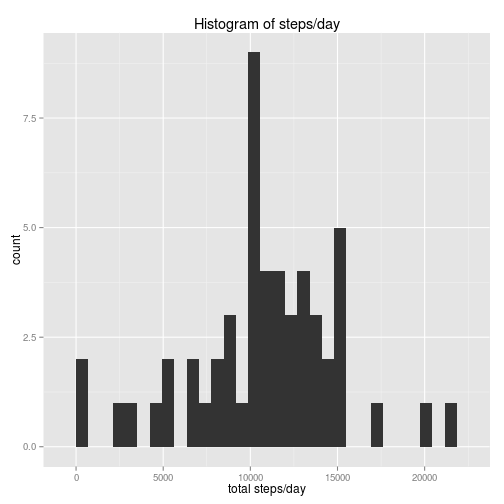
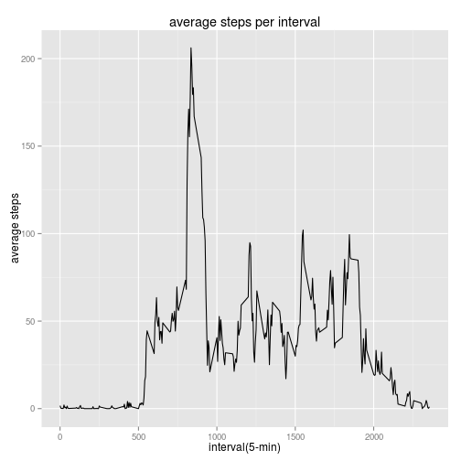
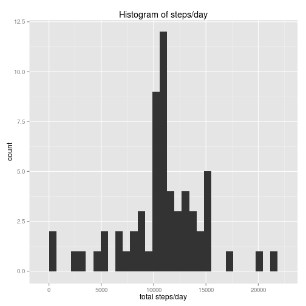
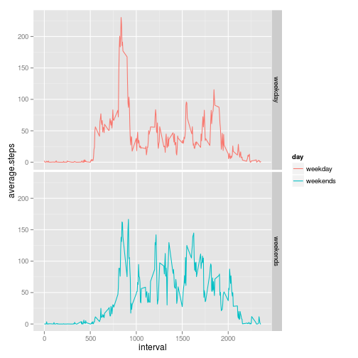

# Reproducible Research: Peer Assessment 1


## Loading and preprocessing the data

```r
filename.zip <- "activity.zip"
filename.csv <- "activity.csv"
# unzip file
unzip(filename.zip, filename.csv)
# load data
data <- read.csv(filename.csv, head = T)
```


## What is mean total number of steps taken per day?

```r
library(ggplot2)
# subset data to get rows with valid steps
data.clean <- na.omit(data)
# turn steps as numeric
data.clean$steps <- as.numeric(data.clean$steps)
# split data by date and apply sum
steps.by.date <- tapply(data.clean$steps, data.clean$date, sum)
# remove na
steps.by.date <- steps.by.date[!is.na(steps.by.date)]
qplot(steps.by.date, geom = "histogram", xlab = "total steps/day", main = "Histogram of steps/day")
```

```
## stat_bin: binwidth defaulted to range/30. Use 'binwidth = x' to adjust this.
```

 

```r

mean.steps.by.date <- mean(steps.by.date, na.rm = T)
median.steps.by.date <- median(steps.by.date, na.rm = T)
```


The mean and median of total number of steps taken per day are 
1.0766 &times; 10<sup>4</sup> and 1.0765 &times; 10<sup>4</sup> respectively.


## What is the average daily activity pattern?

```r
# average over intervals across different days
average.by.inteval <- tapply(data.clean$steps, data.clean$interval, mean)
# find the interval with maximum steps
max.index <- which.max(average.by.inteval)

average.by.inteval <- as.data.frame(average.by.inteval)
# rename col name
colnames(average.by.inteval) <- "average.steps.by.interval"
# use qplot to plot average steps/interval
qplot(x = as.numeric(rownames(average.by.inteval)), y = average.by.inteval[, 
    1], geom = c("line"), xlab = "interval(5-min)", ylab = "average steps", 
    main = "average steps per interval")
```

 

5-minute interval 104 contains the maximum number of steps on average.

## Imputing missing values

```r
# number of na entries in data
num.na <- nrow(data) - nrow(data.clean)
# use mean of the interval to replace NA value
replace.na <- function(index) {
    # find the corresponding index in rownames intervals are not continuous
    i <- which(rownames(average.by.inteval) == as.character(data.replace.clean[index, 
        ]$interval))
    data.replace.clean[index, ]$steps <<- average.by.inteval[i, ]
}
# create a new data frame with na replaced by mean
data.replace.clean <- data.frame(data)
index.na <- which(is.na(data.replace.clean$steps))
temp <- lapply(index.na, FUN = replace.na)
rm(temp)

# recompute mean and median total number of steps per day turn steps as
# numeric
data.replace.clean$steps <- as.numeric(data.replace.clean$steps)
# split data by date and apply sum
steps.replace.by.date <- tapply(data.replace.clean$steps, data.replace.clean$date, 
    sum)

qplot(steps.replace.by.date, geom = "histogram", xlab = "total steps/day", main = "Histogram of steps/day")
```

```
## stat_bin: binwidth defaulted to range/30. Use 'binwidth = x' to adjust this.
```

 

```r

mean.steps.replace.by.date <- mean(steps.replace.by.date, na.rm = T)
median.steps.replace.by.date <- median(steps.replace.by.date, na.rm = T)
```

The mean and median of total number of steps taken per day are 
1.0766 &times; 10<sup>4</sup> and 1.0766 &times; 10<sup>4</sup> 
respectively. As we can see, there is no change in the mean and a slightly change
in median. To find out the reason, we need to locate the positions of NA values.
Here, we list the NA values in data


```r
tapply(is.na(data$steps), data$date, sum)
```

```
## 2012-10-01 2012-10-02 2012-10-03 2012-10-04 2012-10-05 2012-10-06 
##        288          0          0          0          0          0 
## 2012-10-07 2012-10-08 2012-10-09 2012-10-10 2012-10-11 2012-10-12 
##          0        288          0          0          0          0 
## 2012-10-13 2012-10-14 2012-10-15 2012-10-16 2012-10-17 2012-10-18 
##          0          0          0          0          0          0 
## 2012-10-19 2012-10-20 2012-10-21 2012-10-22 2012-10-23 2012-10-24 
##          0          0          0          0          0          0 
## 2012-10-25 2012-10-26 2012-10-27 2012-10-28 2012-10-29 2012-10-30 
##          0          0          0          0          0          0 
## 2012-10-31 2012-11-01 2012-11-02 2012-11-03 2012-11-04 2012-11-05 
##          0        288          0          0        288          0 
## 2012-11-06 2012-11-07 2012-11-08 2012-11-09 2012-11-10 2012-11-11 
##          0          0          0        288        288          0 
## 2012-11-12 2012-11-13 2012-11-14 2012-11-15 2012-11-16 2012-11-17 
##          0          0        288          0          0          0 
## 2012-11-18 2012-11-19 2012-11-20 2012-11-21 2012-11-22 2012-11-23 
##          0          0          0          0          0          0 
## 2012-11-24 2012-11-25 2012-11-26 2012-11-27 2012-11-28 2012-11-29 
##          0          0          0          0          0          0 
## 2012-11-30 
##        288
```

From the result, we see that once NA appears, the data is NA for all intervals
measured in that day. There is no partially recorded data, Either the data is
valid for a day, or the data is completely lost for a day. Thus, imputing data 
doesn't affect the total steps of days with valid measurements. 

## Are there differences in activity patterns between weekdays and weekends?

```r
extract.day <- function(index) {
    t <- weekdays(as.Date(data.replace.clean[index, ]$date))
    
    if (identical(t, "Saturday") | identical(t, "Sunday")) {
        day <- "weekend"
    } else {
        day <- "weekday"
    }
    day
}

# generate a vector indicating whether it's a weekday or weekend
days <- sapply(1:nrow(data.replace.clean), extract.day)
days <- as.factor(days)
data.replace.clean$days <- days

# subset data into weekday and weekend
data.weekday <- subset(data.replace.clean, data.replace.clean$days == "weekday")
data.weekend <- subset(data.replace.clean, data.replace.clean$days == "weekend")

# compute average for each interval seperately for weekday and weekend
average.by.inteval.weekday <- tapply(data.weekday$steps, data.weekday$interval, 
    mean)
weekday.data <- data.frame(average.by.inteval.weekday, rep("weekday", length(average.by.inteval.weekday)), 
    as.numeric(rownames(average.by.inteval.weekday)))
colnames(weekday.data) <- c("average.steps", "day", "interval")

average.by.inteval.weekend <- tapply(data.weekend$steps, data.weekend$interval, 
    mean)
weekend.data <- data.frame(average.by.inteval.weekend, rep("weekends", length(average.by.inteval.weekday)), 
    as.numeric(rownames(average.by.inteval.weekend)))
colnames(weekend.data) <- c("average.steps", "day", "interval")

# combine result together into a data frame
week.data <- rbind(weekday.data, weekend.data)

# plot the result
g <- ggplot(data = week.data, aes(x = interval, y = average.steps, color = day))
g + geom_line() + facet_grid(day ~ .)
```

 

From the figure, there exits some difference between the pattern for week days
and weekend days. In week days, the steps from interval 1000 onwards are less than
those of weekend days. People are likely to do more activities during weekend.
Between interval 500 and interval 1000, the steps are more in week days. 
Probably due the fact that people are commuting during that period of time.
